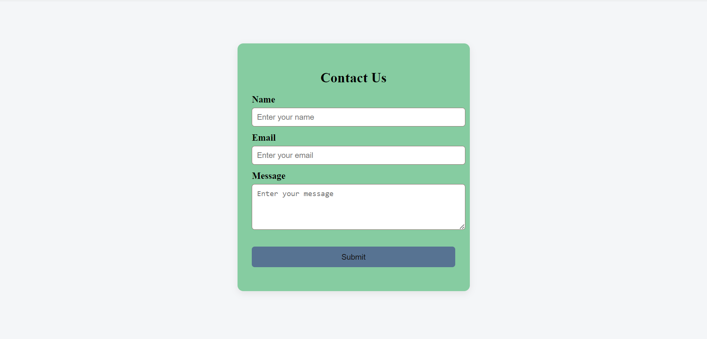
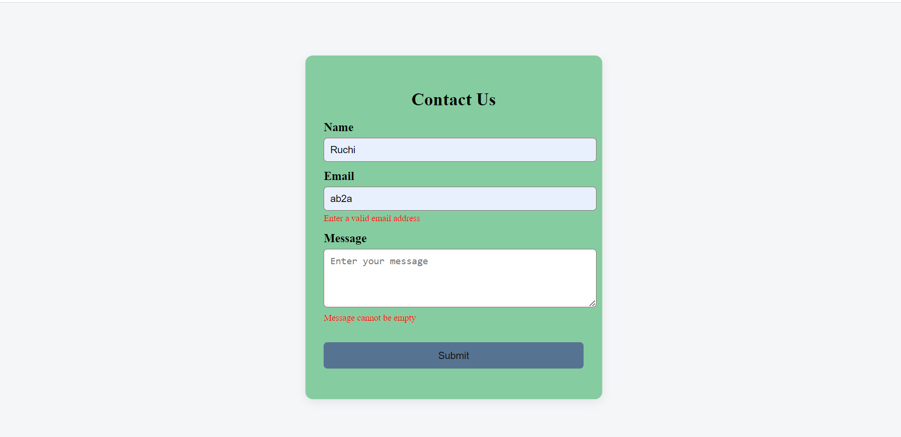
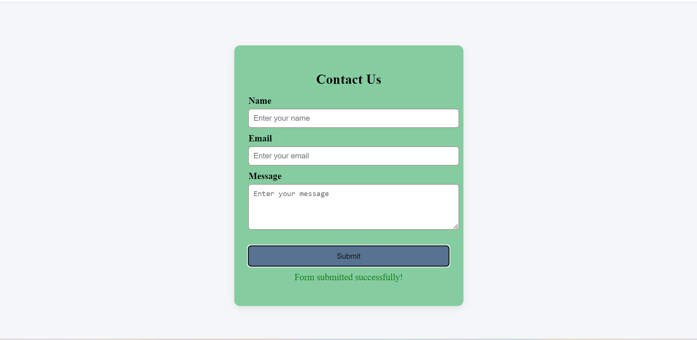

-->Contact Form with JavaScript Validation

A simple and responsive contact form built using HTML, CSS, and JavaScript.
This project demonstrates client-side validation using regular expressions and user-friendly error messages.

--> Objective
Build a contact form that:
* Accepts Name, Email, and Message
* Validates inputs on the client side
* Prevents submission if inputs are invalid
* Displays error messages below fields
* Shows a success message on valid submission
  
--> Tools Used
* VS Code
* Chrome Browser
* HTML5
* CSS3
* JavaScript (Vanilla JS)

--> Project Structure
contact-form/
│── index.html
│── style.css
│── script.js

--> Features
✅ Clean and responsive UI
✅ Client-side validation
✅ Regex-based email validation
✅ Inline error messages
✅ Prevents invalid submission
✅ Success message on valid submit
✅ Handles edge cases

---

--> Validation Rules

| Field   | Rule                       |
| ------- | -------------------------- |
| Name    | Cannot be empty            |
| Email   | Must be valid email format |
| Message | Cannot be empty            |

--> Form UI

--> Validation Errors

--> Success Message

--> Edge Cases Tested
* Empty inputs
* Invalid email formats
* Inputs with only spaces
* Special characters in message
* Very long text input
* Capital letters in email

--> Future Improvements
* Real-time validation while typing
* Mobile responsiveness improvements
* Character counter
* Backend integration (PHP/Node)
* Email sending functionality

